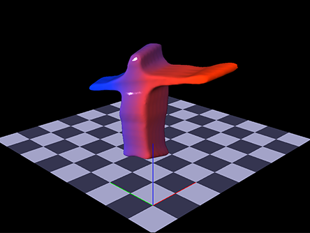
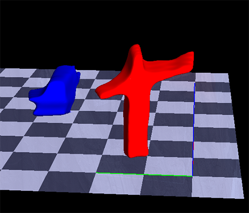

# Object Reconstruction Using Voxel Carving and Mask R-CNN

The aim of this project is to reconstruct foregorund objects using
Mask R-CNN to generate silhouettes and voxel coding to generate
volumes.

This code was written for a CS 231A class project.
For details see the `docs/paper.pdf` file.

## Calibration
Each camera must first be calibrated.
Camera intrinsics are calibrated first and then stored.
Camera extrinsics are then calibrated.
Calibration will start automatically when running the pipeline.
Instructions will be displayed for positioning the chessboard.
First edit the configuration:
```sh
vim config.py
```
And then run the calibration pipeline:
```sh
python3 pipeline.py
```

## GPU Optimized 3D Reconstruction
The 3D reconstruction pipeline can be started using `video.py`.
This file can either be used to stream data directly, record data, or used recorded data.
First edit the configuration:
```sh
vim config.py
```
And then run the reconstruction pipeline:
```sh
python3 video.py
```

## Examples



## License
MIT